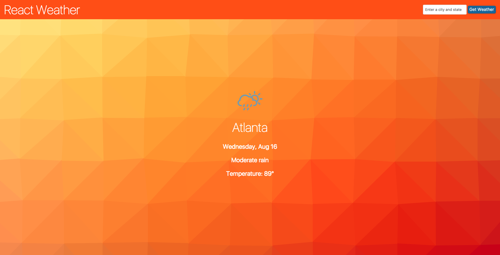

# React Weather

React Weather provides forecast and detail weather for any city in the US using the [OpenWeatherMap API](https://openweathermap.org/api). You can view the [live site](http://jgrim-react-weather.netlify.com/) which is deployed using netlify.

## Screenshots

**Home**

**Forecast**

**Detail**

